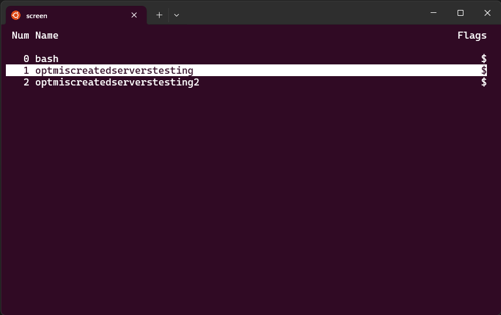
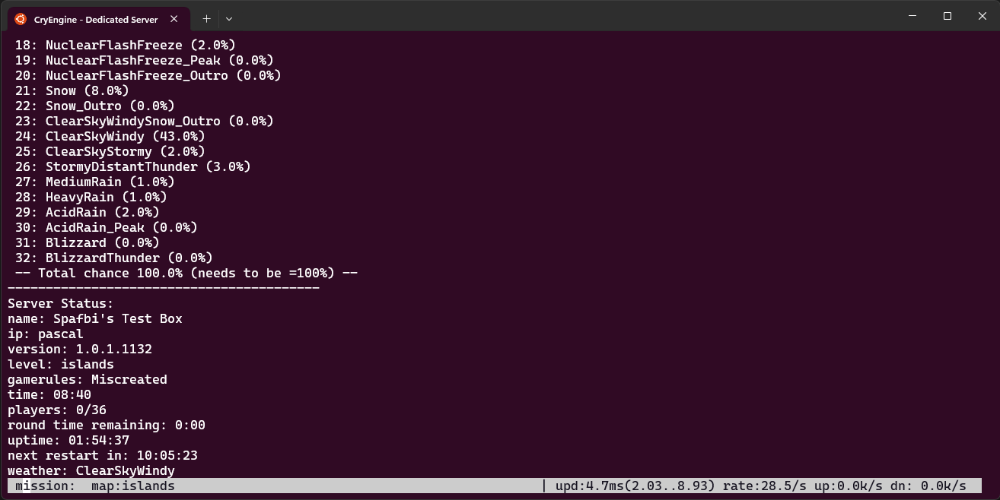

# miscreated-linux-server
This is a set of bash scripts designed to install, configure, and run a Miscreated game server on Ubuntu Linux. See the [Ubuntu WineHQ Repository](https://wiki.winehq.org/Ubuntu) page for Ubuntu distributions (and distributions based on them) which should be supported by these scripts.

# NOTICE
***Here be dragons!*** These scripts are provided as-is. They are a 100% quick-'N-dirty and a kinda hacky solution for running a Miscreated server on Linux. The scripts may or may not work, there's little to no error handling in the scripts at this time, and while it's unlikely it's not entirely out of the realm of possibility that your Ubuntu installation will be corrupted, become unusable, and may require reinstallation. If the scripts work for you, great! If not, just let me know by creating an issue and I'll get around to looking at the issue when I get to it, but I can't promise that I will. You have been warned! 😀

# Requirements
You may use the [install-prerequisites.sh](install-prerequisites.sh) script to set up the prerequisites. The [Ubuntu WineHQ Repository](https://wiki.winehq.org/Ubuntu) is added, a *steam* user is created, and (winehq-stable), screen, sudo, wget, steamcmd, lib32gcc, and xvfb.

If you'd rather install and configure the prerequisites yourself, or you're using a Linux distribution not based on a supported Ubuntu version, feel free to look at the the `install-prerequisites.sh` script to see what we're doing and do everything yourself. 😁

# Downloading the scripts
It is suggested you perform these steps as a non-elevated user.
1. Create a directory where the scripts will live on your system and change to that directory. :
```bash
$ mkdir ~/miscreated-server && cd ~/miscreated-server
```
2. From within the miscreated-server directory, download the scripts:
```bash
$ wget https://github.com/Spafbi/miscreated-linux-server/archive/refs/heads/main.zip
```
3. Unzip the zip file
```bash
$ unzip -j main.zip
```
4. Change permissions on the scripts:
```bash
$ chmod +x ~/miscreated-server/*.sh
```

# Running the scripts
> NOTE: You will see plenty of WINE and steam-related warning messages, particularly FIXME and steamservice.so messages. Ignore these messages. Really. They're just noise. Any submitted issues pertaining to these messages will be closed without comment.

## `install-prerequisites.sh`
Updates your Ubuntu installation and installs the required support for running Miscreated on Ubuntu. You may skip this script if you set up all the prerequisites yourself. This script has no command-line options, but must be run as root.

Usage:
```bash
$ sudo ./install-prerequisites.sh
```

## `install-server.sh`
You will need to run this script for each Miscreated server instance you wish to run.

Usage:
```bash
$ sudo ./install-server.sh
```

To change the installation path and user, execute:
```bash
$ sudo ./install-server.sh -directory=/home/steam/miscreated -user=steam
```

The `directory` and `user` switches are optional, but the defaults are listed above. If you wish to install in a different path, or use a system user other than *steam*, you will need to change those options accordingly. If you plan on only running a single server as the *steam* user you can simply run the script without any options (`sudo ./install-server.sh`). 

 > NOTE: A default `hosting.cfg` file will be created and configured for use by your server. While you are prompted for the server name and RCON password, you'll likely want to edit the `hosting.cfg` options as you desire after the installation has completed and prior to starting the server.

 ## `run-server.sh`
 Creates a named *screen* session, and named window within the screen session, in which the server will run. The server will be automatically restarted within the screen session in the event the `sv_maxuptime` value is reached, or if the Miscreated server process is shutdown or experiences a crash.

 Usage:
 ```bash
 $ sudo ./run-server.sh
 ```

 Options and their defaults:
   * -directory=/home/steam/miscreated
   * -map=islands
   * -players=36
   * -port=64090
   * -sv_bind=""
   * -user=steam
   * -whitelisted=""

Example using *some* options:
```bash
$ sudo ./run-server.sh -map=canyonlands -players=100 -whitelisted=1
```

As always, if running multiple servers you will need to keep the `port` for each server at least +/-5 from the port of any other server. So, assuming your first server is running on 64090, for your second server you could use a value of `64095` or `64085`... but definitely not any number between `64086` and `64094` as that'd stomp on the ports used by the first server (base port+4: `64090-64094`)

Most users will not use the `sv_bind` option; this option is only for multi-homed systems. If you're not sure what that means it's almost certain you don't need this option.

Specifying *any* non-empty value for the `whitelisted` option will enable whitelisting... yes, even `-whitelisted=0` will enable whitelisting, so don't specify the `whitelisted` option at all unless you want to use whitelisting for your server.

# Interacting with the console(s)
When the server starts, you should be immediately returned to the command-prompt with no messages. That means it most likely worked. Woohoo! To interact with the console you will need to execute screen as the user running the Miscreated server. Example:

```bash
sudo -u steam screen -ARS miscreated
```

This command executes `screen` as the *steam* user and connects to the *miscreated* session which was started by the `run-server.sh` script.

Press `CTRL-A "` (`CTRL-A`, then `SHIFT '`) to get a list of *windows* in the screen session; use the arrow keys to navigate the list and press ENTER to select a window. You will likely see at least two windows, the first is the bash session started in the first window, the other windows will be the based on the directory paths of the Miscreated servers you are running (see image)



Once you have selected a window containing a running server, you will be able to interact with the Miscreated server console running in that window. You may need to maximize your terminal session window and execute `status` in the Miscreated console for the text in the window to reset. If the screen keeps updating a few times a second and pushes the text up then the window size is too small for the Miscreated server console. The console window should have the server status bar displayed across the bottom, but it will wrap if the window is too small.


Unfortunately, as may be seen in the above image, the status bar covers the command input field...but it still works!


> NOTE: If you want to learn more about `screen` and it's commands, there's a great [cheat sheet over here](https://gist.github.com/jctosta/af918e1618682638aa82).

Of course you are free to use RCON to execute server commands.